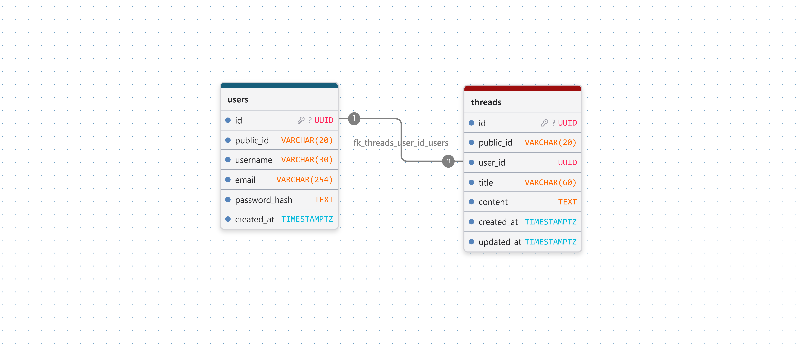

# Q&A Forum API

REST API untuk forum tanya-jawab. Project ini dikerjakan berdasarkan [challenge-2.md](challenge-2.md), dengan fokus pada pengelolaan user dan thread.

## Status

Desain database sudah dibuat dan didokumentasikan. Implementasi schema Drizzle, migration, dan endpoint API akan dikerjakan pada langkah berikutnya.

## Stack

- NestJS
- TypeScript
- PostgreSQL
- Drizzle ORM
- `pg` sebagai PostgreSQL driver
- pnpm sebagai package manager

## Desain database

Desain saat ini terdiri dari dua tabel: `users` dan `threads`.



- [DBML schema](docs/database-schema.dbml)
- [Challenge specification](challenge-2.md)

### Tabel `users`

| Kolom | Tipe | Peran |
| --- | --- | --- |
| `id` | `UUID` | Primary key internal database. |
| `public_id` | `VARCHAR(20)` | Identifier yang digunakan di batas API, misalnya `U001`. Unik dan tidak boleh kosong. |
| `username` | `VARCHAR(30)` | Username unik dan wajib diisi. |
| `email` | `VARCHAR(254)` | Email unik dan wajib diisi. |
| `password_hash` | `TEXT` | Hanya menyimpan hasil hash password, bukan password asli. |
| `created_at` | `TIMESTAMPTZ` | Waktu user dibuat. |

### Tabel `threads`

| Kolom | Tipe | Peran |
| --- | --- | --- |
| `id` | `UUID` | Primary key internal database. |
| `public_id` | `VARCHAR(20)` | Identifier thread yang digunakan di API, misalnya `T001`. Unik dan tidak boleh kosong. |
| `user_id` | `UUID` | Foreign key ke `users.id`; menunjukkan pemilik thread. |
| `title` | `VARCHAR(60)` | Judul thread. Tidak harus unik karena dua thread boleh memiliki judul sama. |
| `content` | `TEXT` | Isi thread. |
| `created_at` | `TIMESTAMPTZ` | Waktu thread dibuat. |
| `updated_at` | `TIMESTAMPTZ` | Waktu terakhir thread diubah. |

### Relasi dan aturan penghapusan

Relasinya adalah one-to-many:

- satu user dapat memiliki banyak thread;
- setiap thread wajib memiliki tepat satu user;
- karena itu, foreign key berada di sisi yang banyak, yaitu `threads.user_id`;
- `threads.user_id` mengarah ke `users.id`, bukan ke `users.public_id`.

Foreign key menggunakan `ON DELETE CASCADE`. Artinya, ketika sebuah user dihapus, thread milik user tersebut ikut dihapus oleh database. Aturan ini disengaja karena thread tidak boleh menjadi data tanpa pemilik.

`ON UPDATE NO ACTION` dipakai karena UUID internal dianggap immutable: setelah dibuat, `users.id` tidak diganti.

### Keputusan identifier

Setiap tabel memiliki dua identifier:

- `id` adalah UUID internal untuk primary key dan relasi database;
- `public_id` adalah identifier eksternal yang mudah dibaca untuk response/request API.

`public_id` bukan mekanisme authorization dan bukan secret. Hak akses tetap ditentukan dari user yang sedang login dan kepemilikan thread. Nilainya harus dibuat secara aman oleh aplikasi atau database; jangan membuatnya dengan pola `jumlah_row + 1` atau `MAX(id) + 1` karena request bersamaan dapat menghasilkan duplikat.

Belum ada tabel `profiles` terpisah. Jika endpoint profile dibutuhkan, response profile merupakan projection dari data aman pada tabel `users`; `password_hash` tidak pernah dikembalikan.

## Menjalankan project

```bash
pnpm install
pnpm run start:dev
```

Perintah lain yang tersedia:

```bash
pnpm run build
pnpm exec jest --runInBand
pnpm run test:e2e
pnpm run lint
```

`build` memeriksa apakah TypeScript dapat dikompilasi menjadi JavaScript. Test dan lint memiliki tujuan berbeda: test memeriksa perilaku, sedangkan lint memeriksa pola/kualitas kode.

## Dokumentasi lanjutan

Source desain yang dapat diedit ada di [docs/database-schema.dbml](docs/database-schema.dbml), sedangkan gambar ERD ada di [docs/assets/database-erd.png](docs/assets/database-erd.png). README ini menjelaskan keputusan desain tingkat tinggi; detail implementasi akan mengikuti schema Drizzle dan migration yang nanti dibuat.
